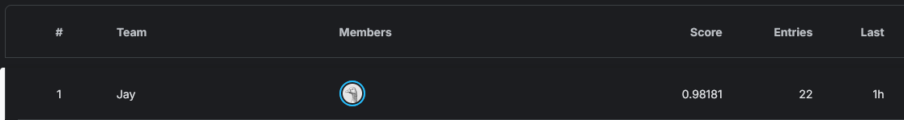

# CSE 144 Final: SigLIP-2 frozen-probe ensemble

**1st place on the public leaderboard** of the
[UCSC CSE 144 Spring 2026 final project](https://www.kaggle.com/competitions/ucsc-cse-144-spring-2026-final-project).



Two frozen SigLIP-2 backbones (gopt-384, SO400M-512). Each gives a logistic
probe and a zero-shot text head; these candidates are averaged with weights
tuned on a 5-fold OOF (weak members can drop to zero). See the report for
details.

## Run

```bash
bash run.sh
```

Or directly:

```bash
pip install -r requirements.txt
python src/ensemble_probes.py \
  --backbone ViT-gopt-16-SigLIP2-384:webli:cache/gopt \
  --backbone ViT-SO400M-16-SigLIP2-512:webli:cache/so400m512 \
  --pseudo 0.85 --write submission.csv
```

Run from the repo root. The dataset ships in `data/` (`train/<class>/*.jpg`,
`test/*.jpg`). `class_names.csv` (`class_id,name`) was built by hand and feeds
the text head.

`--gpu` auto-detects the card and picks batch size + precision. Cold run
(encoding both backbones), measured end-to-end:

| GPU | batch | peak VRAM | time |
|-----|-------|-----------|------|
| A100 80 GB | 256 | ~67 GB | ~9 min |
| L4 24 GB   | 64  | ~18 GB | ~25 min |

Embeddings are cached after the first run, so re-running the probe/ensemble takes
seconds.

The backbones are frozen and public (auto-downloaded by `open_clip`), so there is
no fine-tuned checkpoint. The learned artifacts are the cached frozen embeddings
plus a linear probe that retrains deterministically in seconds. To skip the GPU
encode, download the cached embeddings and drop the `cache/` folder in the repo
root, then run:
[Drive: cached embeddings](https://drive.google.com/drive/folders/15y8g5is0vL5U5s3oU87cpPOIpyKlSx4M?usp=drive_link)

Loss/accuracy figure:

```bash
python src/probe_curve.py --emb cache/gopt/train.npy --out probe_curve.png
```
